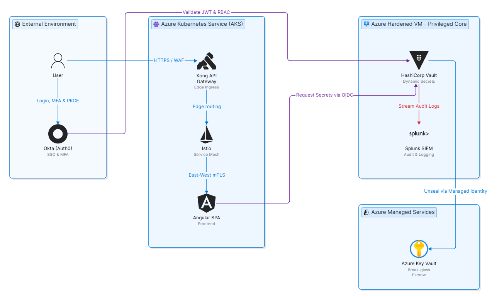

<br>

<div align="center">
  <h1>PAM Governance</h1>
  <p>
    <strong>Privileged Access Management and Identity Governance on a Zero-Trust Cloud Foundation</strong>
  </p>
  <p>
    <a href="LICENSE"></a>
    
    
    
  </p>
</div>

<br>

## PAM Governance

> **PAM Governance** is a cloud-native platform that centralizes secrets, enforces least-privilege access, and secures authentication under a strict Zero-Trust model.

It removes credential sprawl by issuing short-lived, on-demand credentials through `HashiCorp Vault`.

Every login is federated through `Auth0` with mandatory Multi-Factor Authentication, and every privileged call is streamed into the `Splunk` SIEM.

The whole environment is declared as code with `Terraform` and operated through a single-command lifecycle.

<br>

<p align="center">
  <picture>
    <source media="(prefers-color-scheme: dark)" srcset=".github/assets/architecture-dark.png">
    
  </picture>
</p>

## Table of Contents

[Overview](#overview) &nbsp;&middot;&nbsp; [Architecture](#architecture) &nbsp;&middot;&nbsp; [Quick Start](#quick-start) &nbsp;&middot;&nbsp; [Operations](#operations) &nbsp;&middot;&nbsp; [Security Posture](#security-posture) &nbsp;&middot;&nbsp; [Repository Layout](#repository-layout) &nbsp;&middot;&nbsp; [License](#license)

## Overview

PAM Governance separates public-facing workloads from privileged back-office tooling and regulates every flow between them.

It replaces static, shared, and scattered credentials with access that is granted on request, bound to a named identity, scoped to least privilege, and fully recorded.

Five properties define the platform:

- **Encryption everywhere:** mutual TLS between meshed services via `Istio`, with hardened boundaries at the edge.
- **Dynamic secrets:** `HashiCorp Vault` issues short-lived credentials on demand rather than storing static keys.
- **Continuous audit:** every privileged call flows into the `Splunk` SIEM for real-time observability.
- **Infrastructure-as-code:** provisioned by `Terraform` and rebuilt by an idempotent installer.
- **Federated identity:** `Auth0` enforces Multi-Factor Authentication on every login.

## Architecture

The platform is organized in four zones, shown in the diagram above.

- **External environment:** the users and the `Auth0` identity provider, which performs OpenID Connect Single Sign-On with MFA and issues the tokens that carry role claims.
- **AKS cluster:** the public surface, where the `Kong` gateway terminates traffic at the edge, the `Istio` mesh encrypts east-west traffic with mutual TLS, and the `Angular` single-page app is served by a non-root NGINX.
- **Hardened VM:** the privileged core, running `HashiCorp Vault` for dynamic secrets and `Splunk` for audit, reachable only from an allow-listed administrator address.
- **Azure Key Vault:** the break-glass escrow for Vault's unseal keys and root token, read through a managed identity with no stored credential.

A full breakdown of components, request flows, and the bootstrap sequence is in [`docs/ARCHITECTURE.md`](docs/ARCHITECTURE.md).

## Quick Start

### Prerequisites

| Requirement | Notes |
|---|---|
| `Azure CLI` | Signed in with `az login` to the target subscription. |
| `Terraform` | Version 1.5 or higher. |
| `Auth0 M2M Application` | A Machine-to-Machine application authorized on the Auth0 Management API. |
| `Auth0 Vault Application` | A regular web application used by Vault for OpenID Connect federation. |

### Deployment

Export the Auth0 Management API credentials so `Terraform` can manage the tenant, then set the project variables:

```bash
az login

export AUTH0_DOMAIN="dev-xxxx.eu.auth0.com"
export AUTH0_CLIENT_ID="<m2m_client_id>"
export AUTH0_CLIENT_SECRET="<m2m_secret>"

cp terraform/terraform.tfvars.example terraform/terraform.tfvars
```

Provision the base infrastructure and the cluster workloads with the idempotent targets:

```bash
make deploy-infra   # Provisions the VM, AKS, Key Vault, and Auth0
make deploy-app     # Deploys Istio, Kong, and the SPA
```

## Operations

The Azure compute resources incur cost while running. The project provides a full lifecycle, so billing can be reduced to zero without data loss.

| Command | Action |
|---|---|
| `make stop` | Deallocates AKS and the virtual machine. Compute cost drops to zero. |
| `make start` | Powers the environment back up. Vault restarts sealed. |
| `make unseal` | Reads the escrowed keys from Azure Key Vault and unseals Vault. |
| `make destroy` | Tears down all infrastructure. This action is irreversible. |

## Security Posture

- **Scoped authorization:** the administrator policy grants only the secret-engine access it needs, with no blanket `path "*"` or `sudo` capability.
- **Gated escalation:** assuming the administrator role requires the `PAM_Administrator` group claim injected by `Auth0`.
- **Default-deny network:** Network Security Groups drop all inbound traffic except the allow-listed address, and network policies limit ingress to the gateway and the mesh.
- **Browser hardening:** the single-page app enforces HTTPS and a strict Content Security Policy, and keeps tokens in memory rather than in local storage.
- **Session limits:** `Auth0` enforces MFA on every login, and sessions expire after thirty minutes of inactivity or eight hours in total.

## Repository Layout

```text
.
├── apps/
│   └── web/                  # Angular SPA with Auth0 Single Sign-On
│       ├── src/              # Standalone component, runtime config.json, styles
│       ├── Dockerfile        # Multi-stage build, served by a non-root nginx
│       └── default.conf.template
├── kubernetes/               # Manifests for Deployment, Istio mesh, Kong, NetworkPolicy
├── terraform/                # Infrastructure-as-code (see terraform/README.md)
│   ├── main.tf               # Root: resource group, shared crypto, module wiring
│   ├── outputs.tf variables.tf providers.tf versions.tf
│   └── modules/              # network, key-vault, compute, aks, registry, auth0
├── scripts/                  # Lifecycle automation for deploy, stop, start, unseal, destroy
├── docs/                     # Architecture and reference documents
├── .github/                  # CI pipeline and issue and pull-request templates
└── Makefile                  # Developer and operator entry points
```

## License

This project is released under the [MIT License](LICENSE).
