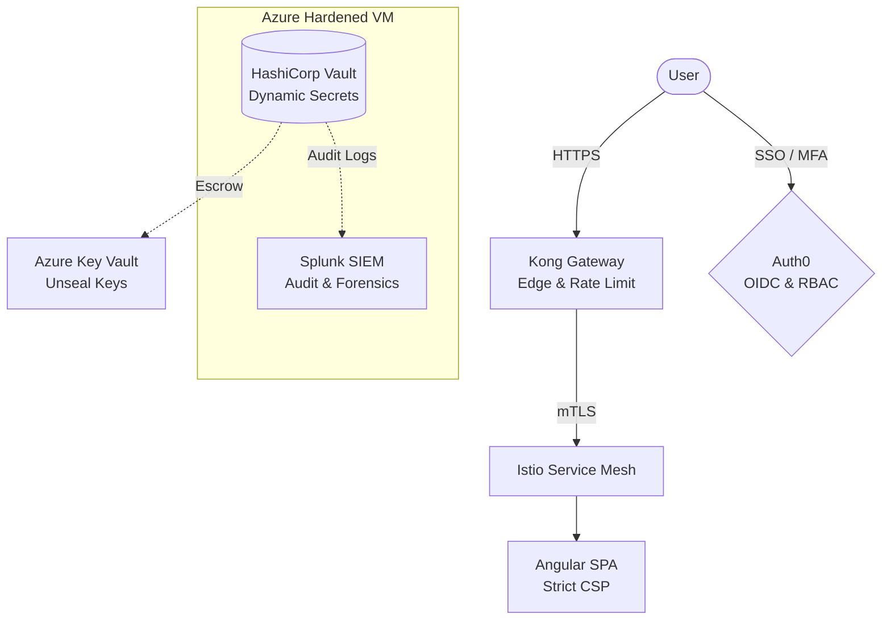

<div align="center">
  <br />
  <h1>PAM Governance (Sentinel)</h1>
  <p>
    <strong>A Cloud-Native Privileged Access Management & Identity Governance Platform</strong>
  </p>
  <p>
    <a href="LICENSE"></a>
    
    
    
    
    
    
    
    
  </p>
</div>

<br />

> **Sentinel** centralizes secrets, enforces least-privilege access, and secures authentication across enterprise infrastructure under a strict Zero-Trust model.

## Table of Contents

- [Overview](#overview)
- [Architecture](#architecture)
- [Quick Start](#quick-start)
- [Operations](#operations)
- [Security Posture](#security-posture)
- [Repository Layout](#repository-layout)
- [License](#license)

## Overview

**PAM Governance** eliminates credential sprawl through dynamic secret generation, robust Role-Based Access Control (RBAC), and OpenID Connect Single Sign-On (SSO). 

### Key Features
- **Zero-Trust Security**: End-to-end TLS, service-to-service mutual TLS (mTLS) via `Istio`, and hardened network boundaries.
- **Dynamic Secrets Management**: Powered by `HashiCorp Vault` to issue short-lived, on-demand credentials rather than static keys.
- **Continuous Monitoring**: Forensic audit logging flowing seamlessly into `Splunk` SIEM for real-time observability.
- **Infrastructure-as-Code (IaC)**: Fully provisioned via `Terraform` with an idempotent installer for one-command environment lifecycle management (build, stop, restart, destroy).
- **Secure Authentication**: Federated through `Auth0` enforcing Multi-Factor Authentication (MFA).

## Architecture

The platform separates public-facing workloads from privileged back-office tooling, strictly regulating traffic flows and access.

- **Frontend & Gateway**: Users reach an `Angular` SPA (served by a non-root NGINX) over HTTPS. Traffic is terminated at the edge by the `Kong` API Gateway, which handles rate-limiting and redirects.
- **Service Mesh**: `Istio` wraps all Azure Kubernetes Service (AKS) workloads, providing automatic sidecar injection and encrypting east-west traffic with mTLS.
- **Privileged Core**: `Vault` and `Splunk` run on a hardened, isolated Azure Virtual Machine restricted to allow-listed administrator IPs. Break-glass materials (Vault unseal keys/root token) are securely escrowed in `Azure Key Vault`.



*(For a deep dive into component breakdowns, request flows, and bootstrapping sequences, refer to [`docs/ARCHITECTURE.md`](docs/ARCHITECTURE.md).)*

## Quick Start

### Prerequisites

Ensure the following tools and credentials are ready on your deployment machine:

| Requirement | Notes |
|:---|:---|
| **Azure CLI** | Signed in with `az login` to the target subscription. |
| **Terraform** | Version `1.5.0` or higher. |
| **Auth0 M2M App** | A Machine-to-Machine application authorized on the Auth0 Management API. |
| **Auth0 Vault App** | A regular web application used by Vault for OIDC federation. |

### Deployment

1. **Configure Environment Variables**
   Export the Auth0 Management API credentials to allow Terraform to manage the tenant:
   ```bash
   az login
   
   export AUTH0_DOMAIN="dev-xxxx.eu.auth0.com"
   export AUTH0_CLIENT_ID="<m2m_client_id>"
   export AUTH0_CLIENT_SECRET="<m2m_secret>"
   ```

2. **Set Project Variables**
   ```bash
   cp terraform/terraform.tfvars.example terraform/terraform.tfvars
   # Edit it with your Vault OIDC app credentials and your admin IP.
   ```

3. **Provision the Environment**
   Run the idempotent Make targets to deploy base infrastructure and cluster workloads:
   ```bash
   make deploy-infra  # Provisions VM, AKS, Key Vault, and Auth0
   make deploy-app    # Deploys Istio, Kong, and SPA
   ```

## Operations

The underlying Azure compute resources (AKS nodes and the VM) incur costs while running. The project provides a complete lifecycle management system to optimize billing without data loss.

| Command | Action |
|:---|:---|
| `make stop` | Deallocates AKS and the VM. Compute costs drop to **zero**. |
| `make start` | Powers the environment back up. |
| `make unseal` | Reads escrowed keys from Azure Key Vault and automatically unseals Vault. |
| `make destroy` | Tears down all infrastructure. **Irreversible**. |

## Security Posture

- **Scoped Authorization**: Vault access is granular. The administrator policy only grants necessary secret engine access without blanket `path "*"` or `sudo` privileges.
- **Identity Escalation**: Escalating to an administrator requires a specific group claim injected by Auth0 for members of the `PAM_Administrator` role.
- **Default-Deny Networking**: Network Security Groups (NSGs) drop all inbound traffic except from an allow-listed IP. Kubernetes network policies restrict ingress purely to the gateway and mesh control plane.
- **Hostile Browser Hardening**: The SPA enforces HTTPS, HSTS, and a strict Content Security Policy (CSP), and keeps authentication tokens strictly in-memory (not in local storage).
- **Session Limits**: Auth0 enforces MFA on every login, with sessions expiring after 30 minutes of inactivity or 8 hours total.

## Repository Layout

```text
.
├── apps/
│   └── web/                  # Angular SPA (Auth0 SSO)
│       ├── src/              # Standalone component, runtime config.json, styles
│       ├── Dockerfile        # Multi-stage build, served by non-root nginx
│       └── default.conf.template
├── kubernetes/               # Manifests: Deployment, Istio mesh, Kong, NetworkPolicy
├── terraform/                # Infrastructure-as-Code (see terraform/README.md)
│   ├── main.tf               # Root: resource group, shared crypto, module wiring
│   ├── outputs.tf variables.tf providers.tf versions.tf
│   └── modules/              # network, key-vault, compute, aks, registry, auth0
├── scripts/                  # Lifecycle automation (deploy, stop, start, unseal, destroy)
├── docs/                     # Architecture and diagrams
├── .github/                  # CI pipeline and issue/PR templates
└── Makefile                  # Developer and operator entry points
```

## License

This project is open-source and licensed under the [MIT License](LICENSE).
